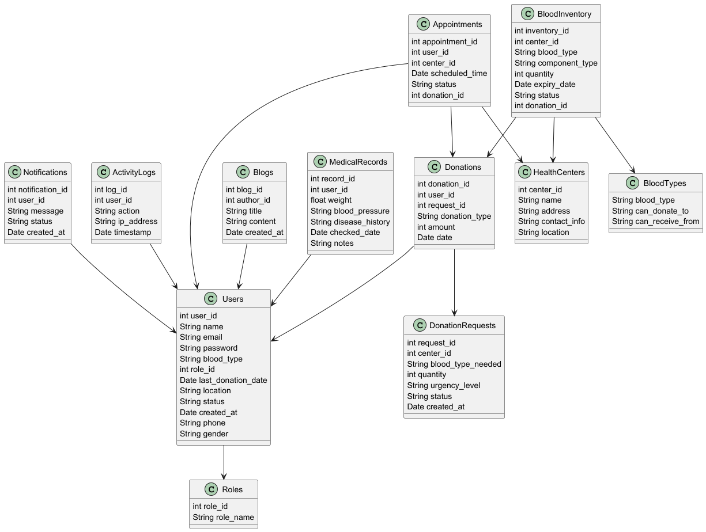

# Java Lab Project

## Giới thiệu đề tài
Đề tài của nhóm tập trung vào việc phát triển một ứng dụng:
Blood Donation Support System
Phần mềm hỗ trợ hiến máu
ACTOR:
Guest
Member
Staff
Admin
Phần mềm hỗ trợ việc hiến máu cho 01 cơ sở y tế.
- Trang chủ giới thiệu cơ sở y tế, tài liệu về các loại máu, blog chia sẻ kinh nghiệm, ...
- Chức năng cho phép người dùng đăng ký nhóm máu, thời điểm sẵn sàng hiến máu.
- Chức năng cho phép người cần máu tra cứu thông tin các nhóm máu phù hợp cần hiến theo việc truyền máu toàn phần (nhóm máu). Ngoài ra hệ thống cũng cho phép tìm kiếm các nhóm máu có thể truyền theo các thành phần máu (hồng cầu, huyết tương, tiểu cầu).
- Chức năng cho phép tìm kiếm người cần máu và người hiến máu theo khoảng cách.
- Chức năng cho phép đăng ký các trường hợp cần máu khẩn cấp.
- Quản lý quá trình thực hiện hiến máu từ lúc gửi yêu cầu cần máu cho đến khi hoàn tất việc hiến máu. Quản lý các trường hợp xảy ra trong quá trình yêu cầu cần máu: đơn vị máu có sẵn, không có đơn vị máu sẵn cần kết nối với người hiến máu, ...
- Quản lý số lượng các đơn vị máu có khả năng của cơ sở y tế.
- Chức năng nhắc nhở thời gian phục hồi giữa các lần hiến máu.
- Quản lý hồ sơ người dùng, lịch sử hiến máu.
- Dashboard & Report.

## Thành viên nhóm
- Nguyễn Nhật Hào - [Vai trò: Leader, Developer,Designer]
- Lê Hoàng Phúc - [Vai trò:Database,Developer]
- Phan Tấn Thuận - [Vai trò:Developer,Designer]
- Bùi Văn Ý - [Vai trò: Developer, Use case]

## Tài liệu và tài nguyên
- **Link Figma**: https://www.figma.com/design/Eky7yuhoYzaOERYHojC8hW/Untitled?node-id=0-1&t=RZfe7tKimf9CXEMf-1
- **Use Case Diagram**:
- **Link use case**:https://drive.google.com/drive/folders/11U8IEAm0wlEs782jPfQsCB1V8r5Da21j?hl=vi
- )  
- **Class Diagram**:  
  )  
  

## Hướng dẫn sử dụng
[Mô tả ngắn về cách chạy hoặc sử dụng dự án nếu có, ví dụ: Clone repository và chạy file main.java]

