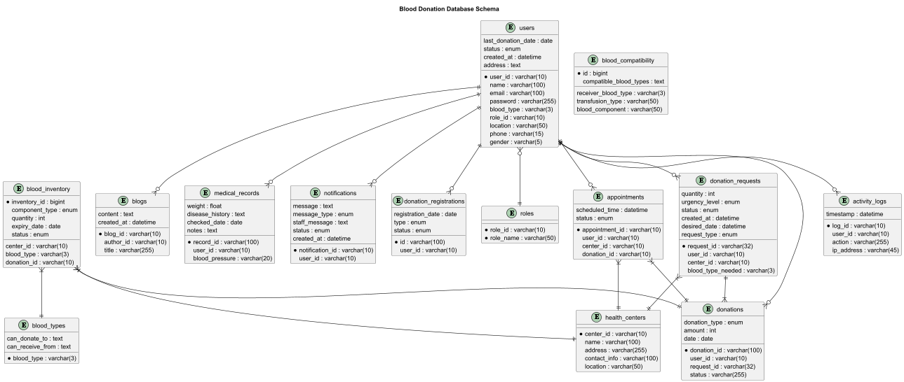

# Java Lab Project - Blood Donation Support System

## Giới thiệu đề tài
Đề tài của nhóm tập trung vào việc phát triển một ứng dụng **Blood Donation Support System** - Phần mềm hỗ trợ hiến máu cho cơ sở y tế.

### Các Actor trong hệ thống
- **Guest**: Khách truy cập
- **Member**: Thành viên đã đăng ký
- **Staff**: Nhân viên y tế
- **Admin**: Quản trị viên

### Chức năng chính
- **Trang chủ**: Giới thiệu cơ sở y tế, tài liệu về các loại máu, blog chia sẻ kinh nghiệm
- **Đăng ký hiến máu**: Cho phép người dùng đăng ký nhóm máu và thời điểm sẵn sàng hiến máu
- **Tra cứu tương thích máu**: Tìm kiếm nhóm máu phù hợp theo truyền máu toàn phần và các thành phần máu (hồng cầu, huyết tương, tiểu cầu)
- **Tìm kiếm theo khoảng cách**: Tìm kiếm người cần máu và người hiến máu theo vị trí địa lý
- **Đăng ký cần máu khẩn cấp**: Quản lý các trường hợp cần máu gấp
- **Quản lý quy trình hiến máu**: Theo dõi toàn bộ quá trình từ yêu cầu đến hoàn tất
- **Quản lý kho máu**: Theo dõi số lượng đơn vị máu có sẵn
- **Nhắc nhở hiến máu**: Thông báo thời gian phục hồi giữa các lần hiến máu
- **Quản lý hồ sơ**: Lưu trữ thông tin người dùng và lịch sử hiến máu
- **Dashboard & Báo cáo**: Giao diện quản trị và thống kê

## Thành viên nhóm
- **Nguyễn Nhật Hào** - [Vai trò: Leader, Developer, Designer]
- **Lê Hoàng Phúc** - [Vai trò: Database, Developer]
- **Phan Tấn Thuận** - [Vai trò: Developer, Designer]
- **Bùi Văn Ý** - [Vai trò: Developer, Use case]

## Tài liệu và tài nguyên
- **Figma Design (User Interface)**: [Link Figma](https://www.figma.com/design/Eky7yuhoYzaOERYHojC8hW/Untitled?node-id=0-1&t=RZfe7tKimf9CXEMf-1)
- **Figma Design (Admin Interface)**: [Link Figma Admin](https://www.figma.com/design/Eky7yuhoYzaOERYHojC8hW/Untitled?node-id=0-1&p=f&t=LDWgn8vXHrBiFcNK-0)
- **Use Case Documents**: [Google Drive](https://drive.google.com/drive/folders/11U8IEAm0wlEs782jPfQsCB1V8r5Da21j?hl=vi)
- **Class Diagram**:  
  

## Công nghệ sử dụng
### Backend
- **Spring Boot**: Framework chính
- **Spring Security**: Bảo mật và xác thực
- **Spring Data JPA**: Truy cập dữ liệu
- **MySQL**: Cơ sở dữ liệu
- **JWT**: Xác thực token
- **Docker**: Containerization

### Frontend
- **HTML/CSS/JavaScript**: Giao diện người dùng
- **Custom CSS**: Styling tự viết
- **Google Fonts (Inter)**: Typography
- **jQuery**: Thư viện JavaScript
- **Slick**: Slider/Carousel

## Hướng dẫn cài đặt và chạy

### Yêu cầu hệ thống
- Java 11 hoặc cao hơn
- Maven 3.6+
- Node.js (cho frontend server)
- Docker (tùy chọn)

### Cách 1: Chạy với Docker (Chỉ Database)

Hiện tại dự án chỉ có Docker Compose cho MySQL database:

```bash
# Di chuyển vào thư mục backend
cd backend

# Chạy MySQL database với Docker Compose
docker-compose up -d

# Kiểm tra container đang chạy
docker ps

# Xem logs nếu cần
docker-compose logs mysql
```

**Lưu ý**: Sau khi chạy Docker Compose, bạn vẫn cần chạy backend và frontend riêng biệt theo Cách 2.

### Cách 2: Chạy thủ công (Khuyến nghị)

#### Bước 1: Khởi động Database
```bash
# Di chuyển vào thư mục backend
cd backend

# Chạy MySQL với Docker Compose
docker-compose up -d

# Đợi database khởi động hoàn tất (khoảng 30 giây)
```

#### Bước 2: Chạy Backend
```bash
# Trong thư mục backend, cài đặt dependencies
mvn clean install

# Chạy ứng dụng Spring Boot
mvn spring-boot:run
```

#### Bước 3: Chạy Frontend
```bash
# Mở terminal mới, di chuyển vào thư mục frontend
cd frontend

# Cài đặt http-server (nếu chưa có)
npm install -g http-server

# Chạy server
http-server . -p 8081 --cors
```

### Truy cập ứng dụng
- **Frontend**: http://localhost:8081
- **Backend API**: http://localhost:8082
- **Admin Dashboard**: http://localhost:8081/admin/

## Cấu trúc dự án
```
Java_lab/
├── backend/                 # Spring Boot Backend
│   ├── src/main/java/      # Source code Java
│   ├── src/main/resources/ # Configuration files
│   └── pom.xml            # Maven dependencies
├── frontend/               # HTML/CSS/JS Frontend
│   ├── admin/             # Admin interface
│   ├── assets/            # Static resources
│   ├── css/               # Stylesheets
│   └── js/                # JavaScript files
└── docs/                  # Documentation
```

## Đóng góp
Để đóng góp vào dự án, vui lòng:
1. Fork repository
2. Tạo branch mới cho feature
3. Commit changes
4. Tạo Pull Request


